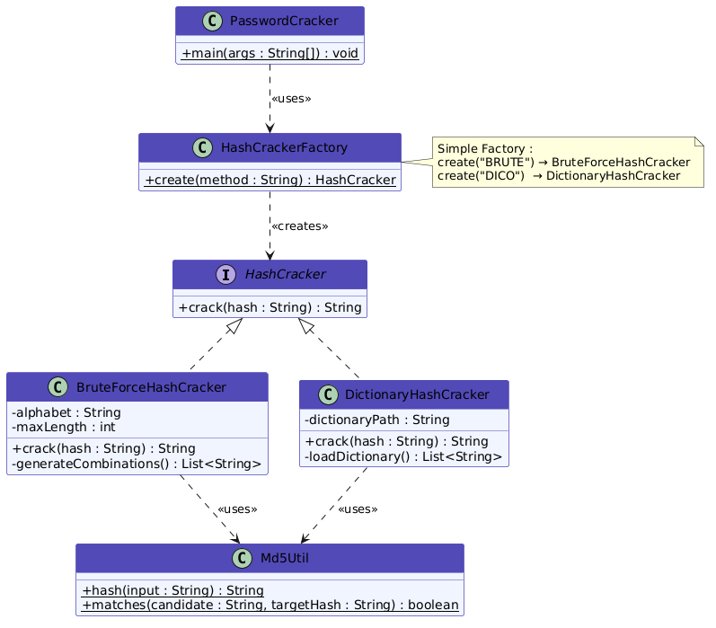
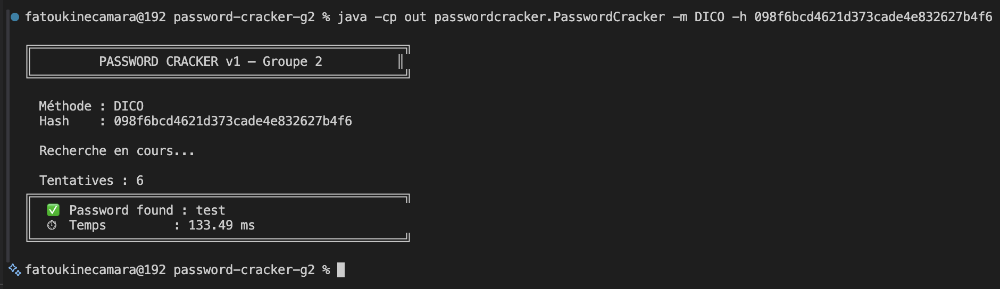
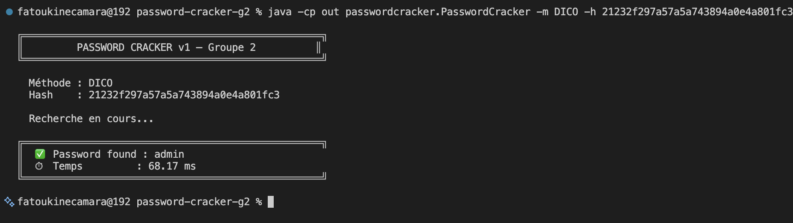
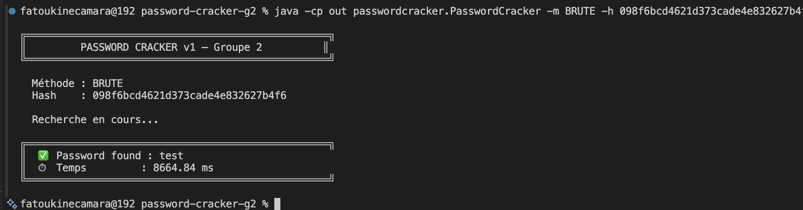
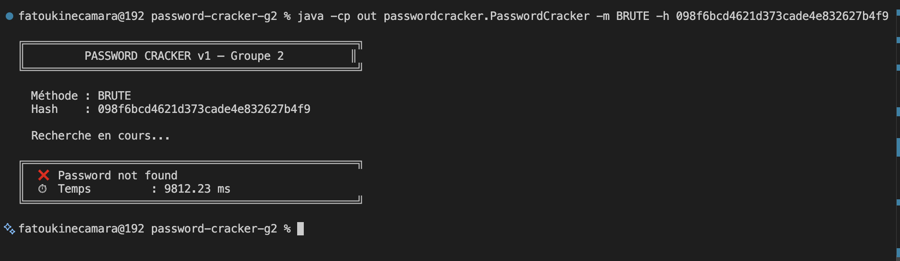
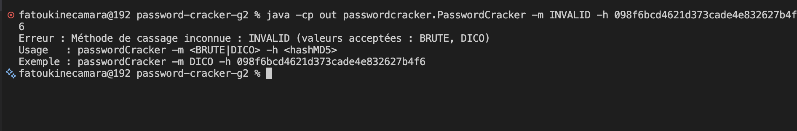

# PasswordCracker — Groupe 2 - GLSIA 

> Mini-Projet 1 — Mise en œuvre du patron Simple Factory  
> Cours : Initiation aux patrons de conception et aux tests logiciels  
> École Supérieure Polytechnique (ESP/UCAD) — L3 GLSI — 2025/2026
> **Membres :**  GUEYE Mouhamadou, NDIAYE Dieynaba, GUEYE Ndéye, CAMARA Fatou Kiné, SOW Cheikh Djibril

---

## Table des matières

1. [Introduction](#1-introduction)
2. [Présentation du problème](#2-présentation-du-problème)
3. [Architecture](#3-architecture)
4. [Diagramme UML](#4-diagramme-uml)
5. [Usage du patron Simple Factory](#5-usage-du-patron-simple-factory)
6. [Résultats obtenus](#6-résultats-obtenus)
7. [Difficultés rencontrées](#7-difficultés-rencontrées)
8. [Conclusion](#8-conclusion)

---

## 1. Introduction

La question de la sécurité des mots de passe est aujourd'hui au cœur des préoccupations de tout développeur. Pourtant, dans la pratique, on constate encore régulièrement des fuites de bases de données où des mots de passe faibles — "admin", "123456", "azerty" — sont retrouvés en quelques secondes. Ce constat n'est pas théorique : des outils de cassage de mots de passe existent et sont utilisés quotidiennement dans les audits de sécurité pour évaluer la robustesse des systèmes.

C'est dans ce contexte que s'inscrit ce projet. **PasswordCracker** est un outil en ligne de commande développé en Java qui tente de retrouver un mot de passe à partir de son empreinte MD5, en proposant deux méthodes d'attaque : par dictionnaire et par force brute. Au-delà de la fonctionnalité, ce projet est avant tout un exercice de conception — l'occasion de mettre en œuvre le patron **Simple Factory** et de mesurer concrètement ce qu'il apporte, mais aussi ce qu'il ne résout pas.

---

## 2. Présentation du problème

### Pourquoi ne stocke-t-on pas les mots de passe en clair ?

Imaginons une base de données compromise. Si les mots de passe sont stockés en clair, l'attaquant les lit directement. Pour éviter ça, on ne stocke jamais le mot de passe lui-même, mais son **empreinte** — le résultat d'une fonction de hachage appliquée au mot de passe. Lors d'une connexion, on hache le mot de passe saisi et on compare les deux empreintes.

MD5 (Message Digest Algorithm 5) est l'une de ces fonctions. Elle produit une empreinte hexadécimale de 32 caractères, toujours la même pour une même entrée, et la transformation est **irréversible** par calcul direct.

```
"test"     →  098f6bcd4621d373cade4e832627b4f6
"Test"     →  0cbc6611f5540bd0809a388dc95a615b  
"test "    →  6f8db599de986fab7a21625b7916589c
```

Un seul caractère différent produit une empreinte totalement différente. Impossible d'inverser la fonction — on ne peut que comparer.

### Comment retrouver un mot de passe alors ?

Puisqu'on ne peut pas inverser MD5, la seule approche est de **tester des candidats** : on prend un mot, on calcule son hash, on compare avec le hash cible. Si ça correspond, on a trouvé. Deux stratégies principales existent :

- **Attaque par dictionnaire** : on teste une liste de mots courants. Rapide, efficace sur les mots de passe faibles, mais inutile si le mot de passe ne figure pas dans la liste.
- **Attaque par force brute** : on génère et teste toutes les combinaisons possibles de caractères. Exhaustive — elle trouvera toujours — mais le temps de calcul explose avec la longueur du mot de passe.

### Le problème de conception

Ce projet doit prendre en charge deux stratégies de cassage, potentiellement plus à l'avenir. Sans réflexion de conception, le programme principal finit par ressembler à ça :

```java
//  Sans patron — dépendance forte, code rigide
if (method.equals("BRUTE")) {
    BruteForceHashCracker cracker = new BruteForceHashCracker();
    result = cracker.crack(hash);
} else if (method.equals("DICO")) {
    DictionaryHashCracker cracker = new DictionaryHashCracker();
    result = cracker.crack(hash);
}
```

Le programme principal connaît et dépend directement de chaque implémentation. Ajouter une stratégie signifie toucher au code principal — une violation directe du principe **Single Responsibility**. C'est ce problème que le patron Simple Factory vient résoudre.

---

## 3. Architecture

```
password-cracker-g2/
├── dict.txt                        # Dictionnaire de mots
├── src/
│   └── main/
│       └── java/
│           └── passwordcracker/
│               ├── HashCracker.java
│               ├── HashCrackerFactory.java
│               ├── BruteForceHashCracker.java
│               ├── DictionaryHashCracker.java
│               ├── Md5Util.java
│               └── PasswordCracker.java
└── README.md
```

### Responsabilités des classes

| Classe | Type | Rôle |
|---|---|---|
| HashCracker | Interface | Contrat commun à toutes les stratégies de cassage |
| HashCrackerFactory | Classe | Centralise la création des stratégies selon la méthode choisie |
| BruteForceHashCracker | Classe concrète | Cassage par génération exhaustive de combinaisons a–z |
| DictionaryHashCracker | Classe concrète | Cassage par recherche dans un fichier dictionnaire |
| Md5Util | Utilitaire | Calcul et comparaison de hashs MD5, partagé entre les stratégies |
| PasswordCracker | Main | Point d'entrée, parse les arguments `-m` et `-h` |
---

## 4. Diagramme UML



Le diagramme illustre les relations suivantes :
- `BruteForceHashCracker` et `DictionaryHashCracker` **implémentent** l'interface `HashCracker`
- `HashCrackerFactory` **crée** et retourne un objet de type `HashCracker` — sans exposer les classes concrètes au client
- `PasswordCracker` **utilise** uniquement la fabrique, sans jamais connaître les implémentations
- `Md5Util` est **utilisée** par les deux stratégies pour éviter la duplication du code de hachage

---

## 5. Usage du patron Simple Factory

### Principe

La **Simple Factory** est une classe dont le seul rôle est de créer et retourner des objets. Elle reçoit un paramètre qui identifie le type d'objet voulu, et retourne une instance du bon type — toujours derrière une interface commune.

```java
//  Avec Simple Factory — le client ne connaît que l'interface
HashCracker cracker = HashCrackerFactory.create("BRUTE");
String result = cracker.crack("098f6bcd4621d373cade4e832627b4f6");
```

Le programme principal ne sait pas ce qu'est `BruteForceHashCracker`. Il sait seulement qu'il a un objet capable de faire `crack()`. C'est le polymorphisme au service du découplage.

### Implémentation dans ce projet

```java
public class HashCrackerFactory {
    private static final String METHOD_BRUTE = "BRUTE";
    private static final String METHOD_DICO = "DICO";
    private static final String DEFAULT_DICTIONARY_PATH = "dict.txt";

    private HashCrackerFactory() { }

    public static HashCracker create(String method) {
        if (method == null) {
            throw new IllegalArgumentException("La méthode de cassage ne peut pas être nulle");
        }
        switch (method.toUpperCase()) {
            case METHOD_BRUTE: return new BruteForceHashCracker();
            case METHOD_DICO:  return new DictionaryHashCracker(DEFAULT_DICTIONARY_PATH);
            default: throw new IllegalArgumentException(
                "Méthode de cassage inconnue : " + method
                + " (valeurs acceptées : " + METHOD_BRUTE + ", " + METHOD_DICO + ")");
        }
    }
}
```

Quelques choix notables : le constructeur privé empêche d'instancier la fabrique inutilement, et `.toUpperCase()` rend la saisie insensible à la casse.

### Questions de réflexion

**1. Quels avantages apporte la fabrique simple ?**

- **Centralisation** : toute la logique de création est dans un seul endroit. Si `BruteForceHashCracker` change de constructeur, on ne modifie que la fabrique — pas le programme principal.
- **Découplage** : `PasswordCracker` dépend uniquement de l'interface `HashCracker`, jamais des classes concrètes. On peut remplacer une implémentation sans toucher au reste.
- **Lisibilité** : `HashCrackerFactory.create("BRUTE")` exprime clairement l'intention, sans détails d'instanciation.
- **Validation centralisée** : les erreurs de méthode inconnue sont gérées dans la fabrique, pas dispersées dans le code client.

**2. Quels sont ses inconvénients ?**

- **Violation du principe Open/Closed** : c'est la limite fondamentale. Ajouter une stratégie comme `RainbowTableHashCracker` impose d'ouvrir et modifier `HashCrackerFactory` — exactement ce que le principe interdit.
- **Non extensible par héritage** : contrairement au patron *Factory Method*, on ne peut pas créer une sous-classe de `HashCrackerFactory` pour adapter son comportement.
- **Couplage résiduel** : la fabrique connaît toutes les classes concrètes. Plus le nombre de stratégies croît, plus elle devient fragile.

**3. Que faut-il modifier lorsqu'une nouvelle stratégie est ajoutée ?**

Trois étapes sont nécessaires :

1. Créer la nouvelle classe qui implémente `HashCracker`
2. **Modifier `HashCrackerFactory`** en ajoutant un `case` dans le `switch`
3. Fournir les ressources nécessaires à la nouvelle stratégie (nouveau dictionnaire, table arc-en-ciel, etc.)

Le fait que l'étape 2 oblige à modifier une classe existante est le signe que la Simple Factory viole le principe Open/Closed.

**4. La fabrique respecte-t-elle le principe Open/Closed ?**

Non. Le principe stipule qu'une classe doit être *ouverte à l'extension* mais *fermée à la modification*. Ici, chaque nouvelle stratégie impose de modifier `HashCrackerFactory`. Ce n'est pas une erreur de notre implémentation — c'est une **limite structurelle** du patron Simple Factory lui-même. Le patron Factory Method, étudié dans le mini-projet suivant, résout exactement ce problème en permettant l'extension par héritage, sans modification du code existant.

---

## 6. Résultats obtenus

### Utilisation

Les deux stratégies ont été testées avec succès sur plusieurs hashs MD5. 
Le programme retrouve correctement le mot de passe correspondant ou 
indique qu'il n'a pas été trouvé.

```bash
# 1. Compiler
javac -d out src/main/java/passwordcracker/*.java

# 2. Dictionnaire — mot trouvé
java -cp out passwordcracker.PasswordCracker -m DICO -h 098f6bcd4621d373cade4e832627b4f6

# 3. Dictionnaire — autre mot trouvé
java -cp out passwordcracker.PasswordCracker -m DICO -h 21232f297a57a5a743894a0e4a801fc3

# 4. Force brute — mot trouvé
java -cp out passwordcracker.PasswordCracker -m BRUTE -h 098f6bcd4621d373cade4e832627b4f6

# 5. Hash inconnu — mot non trouvé
java -cp out passwordcracker.PasswordCracker -m BRUTE -h 098f6bcd4621d373cade4e832627b4f9

# 6. Méthode invalide — gestion d'erreur
java -cp out passwordcracker.PasswordCracker -m INVALID -h 098f6bcd4621d373cade4e832627b4f6
```

### Comparaison des stratégies

| Critère | Dictionnaire | Force Brute |
|---|---|---|
| Vitesse | Rapide (~150ms) | Lente (~10 secondes) |
| Couverture | Limitée aux mots du fichier | Exhaustive (tous les cas) |
| Mot de passe "test" | ✅ Trouvé | ✅ Trouvé |
| Mot de passe hors dictionnaire | ❌ Non trouvé | ✅ Trouvé (si ≤ 4 caractères) |
| Cas d'usage idéal | Mots de passe courants | Mots de passe courts inconnus |

### Sorties console

**Dictionnaire — mot trouvé ("test")**


**Dictionnaire — mot trouvé ("admin")**


**Force brute — mot trouvé ("test")**


**Hash inconnu — mot non trouvé**


**Méthode invalide — gestion d'erreur**


### Vidéo de démonstration

[▶ Voir la démonstration](https://youtu.be/-XgFo8Z08yo)

---

## 7. Difficultés rencontrées

- **Duplication du code MD5** : les deux stratégies ont naturellement chacune commencé avec leur propre méthode de calcul MD5. Nous avons factorisé cette logique dans `Md5Util`, avec un encodage `UTF-8` explicite et une méthode `matches()` directement utilisable, pour respecter le principe DRY et garantir un comportement identique entre les deux stratégies.

- **Portabilité du chemin du dictionnaire** : `dict.txt` était lu avec un chemin relatif qui fonctionnait sur la machine du développeur mais pas forcément sur les autres. Nous avons standardisé le lancement depuis la racine du projet.

- **Gestion des dépendances entre membres** : `DictionaryHashCracker` et `BruteForceHashCracker` dépendent de `HashCracker` et `Md5Util`. Le membre responsable de l'interface devait donc merger en premier. Travailler sans cet ordre aurait provoqué des erreurs de compilation sur les autres branches.

- **Finalisation du programme principal** : `PasswordCracker.java` ne pouvait être finalisé qu'après le merge de `HashCrackerFactory`. Ce blocage nous a montré concrètement pourquoi l'identification des dépendances entre composants est une étape de planification à ne pas négliger.

---

## 8. Conclusion

Développer PasswordCracker nous a permis de toucher du doigt quelque chose que les cours théoriques n'illustrent pas toujours clairement : une mauvaise conception se paye très vite, même sur un petit projet. Dès qu'on a voulu ajouter la deuxième stratégie sans patron, le code principal a commencé à grossir et à se rigidifier.

La Simple Factory a résolu ce problème immédiat — le programme principal est resté propre, découplé, lisible. Mais elle a aussi révélé sa propre limite : elle centralise la création, mais elle ne s'efface pas pour autant. Ajouter une stratégie, c'est toujours ouvrir la fabrique.

C'est précisément cette limite qui donne son sens au mini-projet suivant. Le patron Factory Method permettra d'aller plus loin : étendre sans modifier, en laissant le code existant intact.

---

*Projet réalisé par le Groupe 2 — ESP/UCAD, L3 GLSIA — 2025/2026*